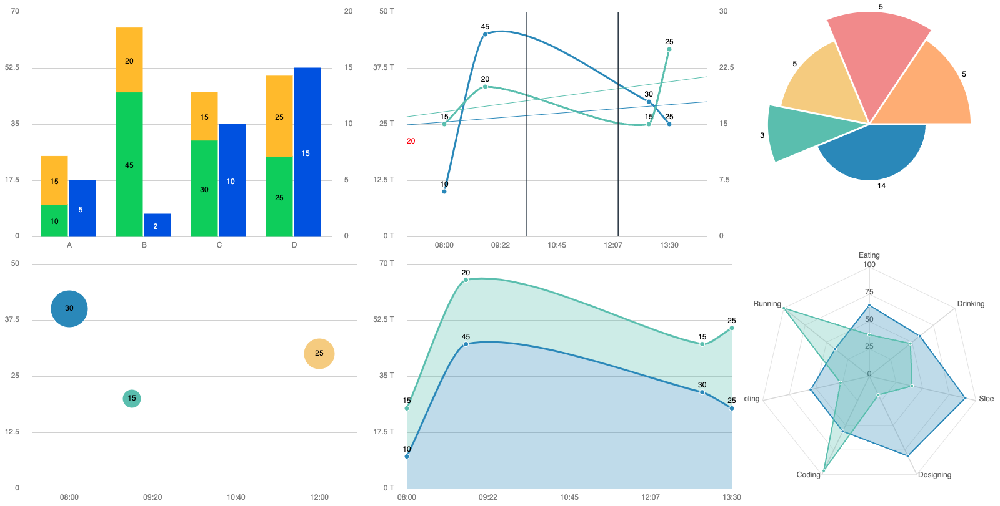

# Simca

**SVG Charts for PHP**

This project aims to be a complete solution for creating SVG charts in PHP. It is especially useful when charts need to be generated on the back-end to be included in emails and PDFs.



## Available Chart Types

### Bar Chart
- Can be stacked
- Can have a right axis with the `nbYkeys2` option

### Line Chart
- Can be curved or straight
- Can include a time scale
- Can display objectives
- Can display events
- Can display a trend line
- Can have a right axis with the `nbYkeys2` option

### Area Chart
Same as Line chart, just set the option `fillOpacity` to a value greater than 0 (i.e. 0.3);

### Pie Chart
- Can be converted to a polar pie chart by adding a coefficient (see example below)

### Bubble Chart
- Can include a time scale

### Radar Chart
- Can be stacked

#### Other options
- `numLines` number of horizontal grid lines in the chart
- `responsive` set to `false` to disable responsive mode
- `showYAxis` set to `false` will hide the Y axis
- `unitY1` / `unitY2` units for the Y axes
- `labelAngle` to rotate the labels of the X axis

## Installation
```php
composer require pierresh\simca
```

## How to use

Example to generate a SVG chart:

```php
use Pierresh\Simca\Charts\BarChart;

$chart = (new BarChart(600, 400))
	->setSeries([[10, 45, 30, 25], [15, 20, 15, 25], [5, 2, 10, 15]])
	->setLabels(['A', 'B', 'C', 'D'])
	->setColors(['#2dd55b', '#ffc409', '#0054e9'])
	->setOptions([
		'stacked' => true,
		'nbYkeys2' => 1,
	])
	->render();
```
```php
use Pierresh\Simca\Charts\LineChart;

$chart = (new LineChart(600, 400))
	->setSeries([[10, 45, 30, 25], [15, 20, 15, 25]])
	->setLabels([
		'2024-06-01 08:00',
		'2024-06-01 09:00',
		'2024-06-01 13:00',
		'2024-06-01 13:30',
	])
	->addObjectiveY1(20)
	->addEvent('2024-06-01 10:00')
	->addEvent('2024-06-01 12:15')
	->showTrend()
	->setOptions([
		'timeChart' => true,
		'unitY1' => 'T',
		'nbYkeys2' => 1,
	])
	->render();
```
```php
use Pierresh\Simca\Charts\PieChart;

// The secondary value is an optional coefficient for polar pie chart
$chart = (new PieChart(400, 400))
	->setSeries([[14, 0.5], [3, 0.9], [5, 0.8], [5, 1], [5, 0.9]])
	->render();
```
```php
use Pierresh\Simca\Charts\BubbleChart;

$chart = (new BubbleChart(600, 400))
	->setSeries([
		['2024-06-01 08:00', 40, 30],
		['2024-06-01 09:00', 20, 15],
		['2024-06-01 12:00', 30, 25],
	])
	->setOptions([
		'timeChart' => true,
	])
	->render();
```
```php
use Pierresh\Simca\Charts\RadarChart;

$chart = (new RadarChart(600, 400))
	->setSeries([
		[65, 59, 90, 81, 56, 55, 40],
		[38, 48, 40, 19, 96, 27, 100]
	])
	->setLabels([
		'Eating',
		'Drinking',
		'Sleeping',
		'Designing',
		'Coding',
		'Cycling',
		'Running',
	])
	->setOptions([
		'fillOpacity' => 0.3,
	])
	->render();
```

Alternatively, you can replace `render()` with `renderBase64()` to get a base64 encoded SVG image.

## Development

Clone the repository and install the dependencies:
```bash
git clone https://github.com/pierresh/simca

cd simca

composer install
```

There is a watcher script to automatically refresh the page when a change is made.

You will need to install [BrowserSync](https://browsersync.io/) first:

```bash
npm install -g browser-sync
```

Then the example page can be run with the following command:
```bash
./watcher.sh ./app/index.php
```

🧹 Run refactors using **Rector**
```bash
composer refactor
```

⚗️ Run static analysis using **PHPStan**:
```bash
composer stan
```

✅ Run unit tests using **PEST**
```bash
composer test
```

🚀 Run the entire quality suite:
```bash
composer quality
```